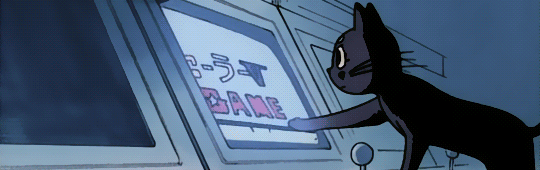

  

 

  

  Engenharia de Software • Desenvolvimento • Produto • Design • Dados • IA

 

  

    Estudante de <strong>Engenharia de Software</strong> e estagiária na <strong>dti digital</strong>.
  

  

    Desenvolvo sistemas e hoje atuo com Dados e BI. Gosto de participar do processo de ponta a ponta: do código ao Design e Produto.
  

  

    No meu tempo livre, você vai me encontrar tocando guitarra, lendo ou jogando.
  

 

  
  &nbsp;
  
  &nbsp;
  
  &nbsp;
  

 

 

  Tech Stack & Tools
    
  

  

  

 
